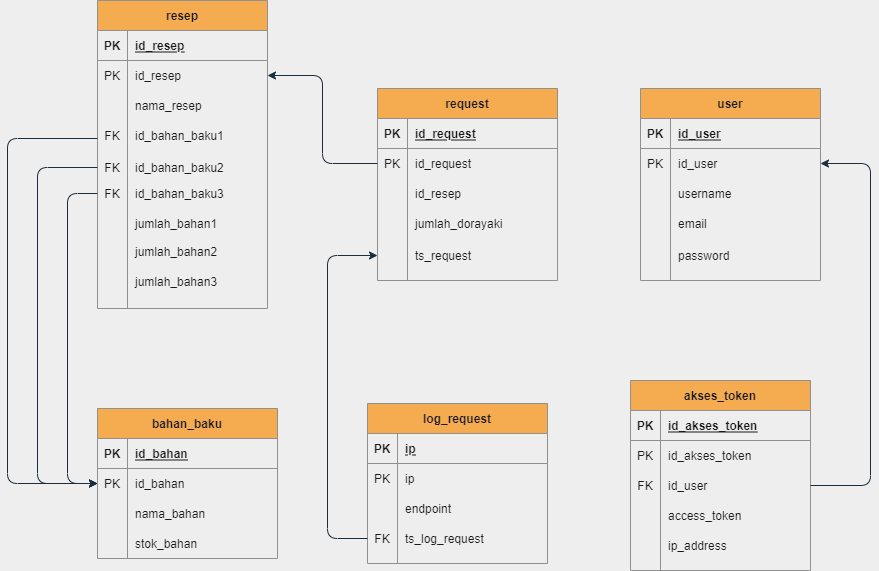

# Dorayaki-Factory-Server 

## Deskripsi singkat aplikasi
Aplikasi Dorayaki-Factory-Servermerupakan sebuah program yang dibangun untuk menghubungkan segala fungsionalitas yang berhubungan dengan pabrik Dorayaki dan database dari sisi backend.

## Endpoint 
Endpoint Security adalah tindakan yang memberikan keamanan dan perlindungan kepada perangkat pengguna akhir.
- pada Dorayaki-Supplier, seharusnya titik endpoint pertamanya adalah: 
    "http://localhost:9999/webservice/dorayaki"
tetapi karena terjadi error titik endpoint ini belum dapat dipakai

## Payload
Payload adalah paket data aktual yang dikirim dengan metode GET pada HTTP

## Response API
Response API adalah standarisasi dalam menginformasikan hasil request kepada client.

## Skema basisdata yang digunakan

- Backend Pabrik Fungsi bahanbaku       : 13519001, 13519025 \
- Backend Pabrik Fungsi connect         : 13519001, 13519025 \
- Backend Pabrik Fungsi createdorayaki  : 13519001, 13519025 \
- Backend Pabrik Fungsi daftarrequest   : 13519001, 13519025 \
- Backend Pabrik Fungsi registerLogin   : 13519199, 13519025 \
- Backend Pabrik Fungsi resep           : 13519001, 13519199 \
- Backend Pabrik Fungsi routes          : 13519199, 13519025 \
- Backend Pabrik Fungsi secret          : 13519001, 13519025 \
- Backend Pabrik Fungsi server          : 13519001, 13519025 \
- Backend Pabrik Fungsi verification    : 13519001, 13519199

### Note:
- Ganti port pada file connect.js sesuai dengan port mysql yang digunakan pada perangkat anda.
- Anda dapat meng-import webede.sql untuk mengisi database anda
- Pastikan nama database anda webede