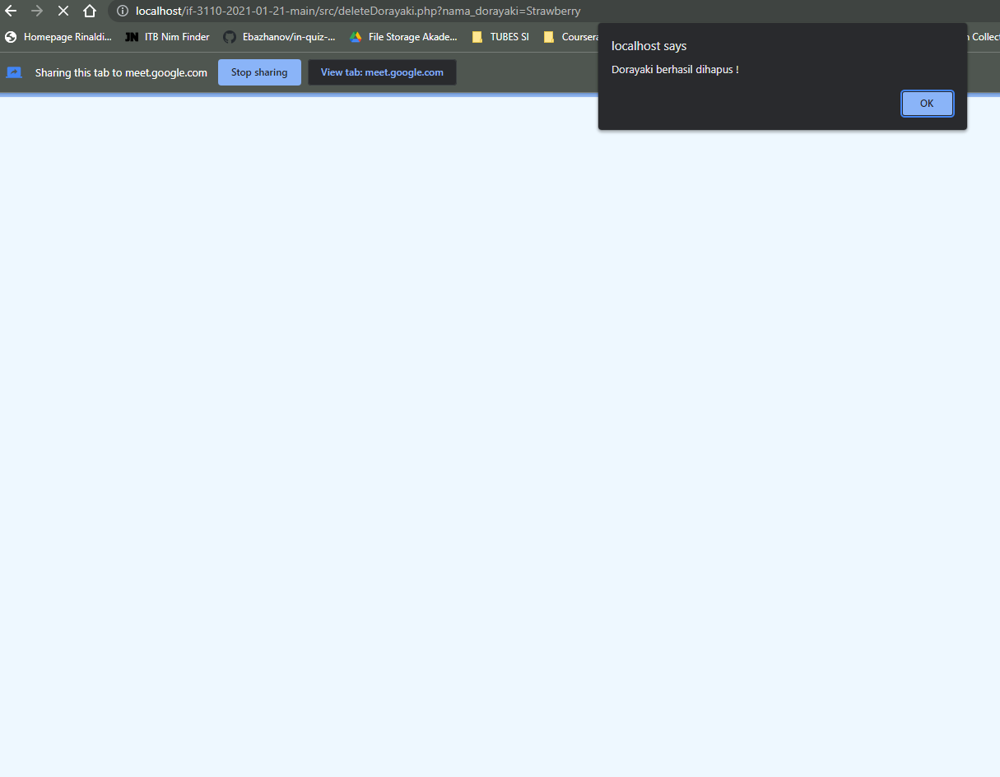

# Webede Store
Webede store merupakan sebuah aplikasi berbasis website yang menjual berbagai jenis varian dari dorayaki.


## Requirement
- XAMPP (versi 8.0.12)
- SQLite3


## Cara instalasi
- Install XAMPP (versi 8.0.12) pada link [here](https://www.apachefriends.org/download.html)
- Install SQLite3 pada link [here](https://www.sqlite.org/download.html)


## Cara menjalankan server
```sh
1. Clone repository `if-3110-2021-01-21-main` dan pindahkan ke dalam folder `./xampp/php`
2. Buka control panel XAMPP, lakukan start pada module Apache dan MySQL
3. Jalankan `http://localhost/if-3110-2021-01-21/src/dashboard.php` pada Browser
```


## Screenshot tampilan aplikasi
### Register


### Login


### Dashboard


### Search


### Tambah Varian Dorayaki


### Detail Varian Dorayaki


### Ubah Stock Dorayaki


### Edit Dorayaki


### Delete Dorayaki


## Buy Dorayaki


## Penjelasan pembagian tugas masing-masing anggota
Pengerjaan tugas dilakukan secara bersama-sama hampir setiap hari (kecuali minggu UTS) dengan menggunakan extension Live Share Vscode.

**Server-side**
- Login : 13519025, 13519199
- Register : 13519001, 13519199
- Dashboard : 13519001, 13519025
- Hasil Pencarian : 13519001, 13519025
- Tambah Varian Dorayaki : 13519001, 13519199
- Detail Varian Dorayaki : 13519025, 13519199
- Pengubahan Stok/Pembelian Dorayaki : 13519001, 13519025

**Client-side**
- Login : 13519025, 13519199
- Register : 13519001, 13519199
- Dashboard : 13519001, 13519025
- Hasil Pencarian : 13519001, 13519025
- Tambah Varian Dorayaki : 13519025, 13519199
- Detail Varian Dorayaki : 13519001, 13519199
- Pengubahan Stok/Pembelian Dorayaki :  13519025, 13519199

**Bonus**
- Edit Dorayaki :Data Expire Time : 13519001, 13519025
- Responsive Design : 13519001, 13519199
- Mengubah informasi tentang varian dorayaki yang sudah ada : 13519001, 13519025

**Other**
- Database : 13519001, 13519025, 13519199
- Docker : 13519001
