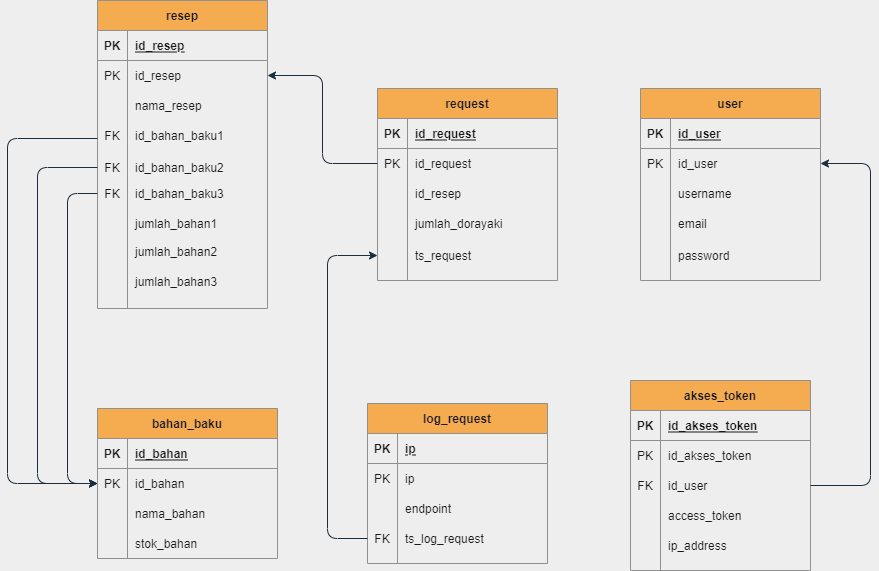

# Dorayaki-Supplier

## Deskripsi singkat aplikasi
Aplikasi Dorayaki-Supplier merupakan sebuah Web Service yang berlaku sebagai supplier bahan-bahan mentah yang dibuat menggunakan bahasa pemrograman Java menggunakan JAX-WS dengan protokol SOAP pada Java Servlet

## Skema basisdata yang digunakan

## Endpoint 
Endpoint Security adalah tindakan yang memberikan keamanan dan perlindungan kepada perangkat pengguna akhir.
- pada Dorayaki-Supplier, seharusnya titik endpoint pertamanya adalah: 
    "http://localhost:9999/webservice/dorayaki"
tetapi karena terjadi error titik endpoint ini belum dapat dipakai

## Payload
Payload adalah paket data aktual yang dikirim dengan metode GET pada HTTP

## Response API
Response API adalah standarisasi dalam menginformasikan hasil request kepada client.

## Penjelasan Pembagian Tugas
- Setup Web Service         --- 13519001, 13519025, 13519199 \
- Implementasi Interface    --- 13519001, 13519025, 13519199